# LO NUEVO

### Últimos cambios (acorde a la pasada reunión)

- Backend fragmentado en microservicios cada uno con su Dockerfile
- Microservicios expuestos (temporalmente para desarrollo) en puertos distintos
- Dockerfile base para intentar minimizar tiempo/espacio
- Cada servicio tiene su propio endpoint "health", ver make health
- Gateway actúa como reverse proxy

- Hay archivos que rehubicar
- Al fragmentar servicios se han ido a la porra cosas que tengo que revisar, 2fa, oauth ....

**Para no tener que andar creando usuarios si accedes a http://localhost:3003/users/all se deben ver todos los ya creados**


### **Health Checks (ver desde el navegador o curl):**
```bash
# Verificar todos los servicios
curl http://localhost:3000/health          # Gateway
curl http://localhost:3001/health         # Auth
curl http://localhost:3002/health         # I18n
curl http://localhost:3003/health         # Database
curl http://localhost:3004/health         # Users
```


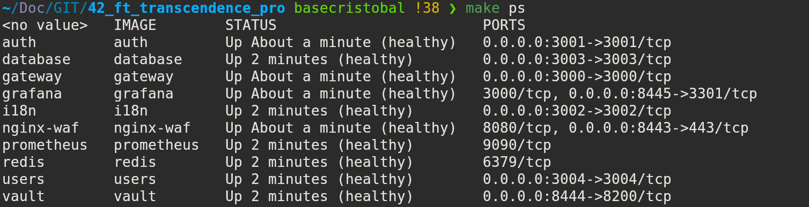


## Índice de Servicios

| Servicio | Puerto | Puerto Variable | Descripción |
|----------|--------|-----------------|-------------|
| Gateway | 3000 | `GATEWAY_PORT` | API Gateway principal |
| Auth Service | 3001 | `AUTH_SERVICE_PORT` | Autenticación y gestión de usuarios |
| I18n Service | 3002 | `I18N_SERVICE_PORT` | Internacionalización y traducciones |
| Database Service | 3003 | `DATABASE_SERVICE_PORT` | Servicio de base de datos |
| Users Service | 3004 | `USERS_SERVICE_PORT` | Gestión de usuarios y admin |


### Rutas del Gateway

#### Métodos GET
| Ruta | Descripción |
|------|-------------|
| `/` | Redirige a login o profile según autenticación |
| `/health` | Estado del gateway |
| `/auth/logout` | Cierra sesión y redirige |
| `/auth/login` | Página de login |
| `/auth/profile` | Página de perfil (requiere auth) |
| `/auth/2fa-required` | Página para 2FA requerido |
| `/2fa/management` | Gestión de 2FA (requiere auth) |
| `/gdpr/management` | Gestión GDPR (requiere auth) |
| `/users/users.html` | Panel admin usuarios (requiere auth) |
| `/users/decode.html` | Generador TOTP |
| `/ready` | Verifica estado de servicios |

#### Métodos POST
| Ruta | Proxy a | Descripción |
|------|---------|-------------|
| `/auth/login` | Auth Service | Proxies login a auth service |
| `/gdpr/*` | Gateway mismo | Rutas GDPR locales |

#### Proxy Routes (ALL methods)
| Patrón | Upstream | Descripción |
|--------|----------|-------------|
| `/auth/*` | `AUTH_SERVICE_URL` | Proxy a auth service |
| `/2fa/*` | `AUTH_SERVICE_URL` | Proxy a 2FA endpoints |
| `/i18n/*` | `I18N_SERVICE_URL` | Proxy a i18n service |
| `/database/*` | `DATABASE_SERVICE_URL` | Proxy a database service |
| `/users/*` | `USERS_SERVICE_URL` | Proxy a users service |

### Rutas de Autenticación

#### Health (GET)
| Ruta | Descripción |
|------|-------------|
| `/health` | Estado del servicio auth |
| `/ready` | Verifica conexión a DB |

#### Autenticación
##### Métodos GET
| Ruta | Descripción |
|------|-------------|
| `/auth/github` | Inicio OAuth GitHub |
| `/auth/github/callback` | Callback OAuth GitHub |
| `/auth/2fa-required` | Página 2FA requerido |
| `/auth/pending-2fa-user` | Obtiene usuario pendiente 2FA |
| `/auth/profile` | Página de perfil (requiere auth) |
| `/auth/profile-data` | Datos del perfil |
| `/auth/logout` | Cierra sesión |
| `/auth/session-status` | Estado de sesión |

##### Métodos POST
| Ruta | Descripción |
|------|-------------|
| `/auth/login` | Login tradicional |
| `/auth/register` | Registro de usuario |

#### 2FA Routes
##### Métodos GET
| Ruta | Descripción |
|------|-------------|
| `/2fa/management` | Gestión 2FA |

##### Métodos POST
| Ruta | Descripción |
|------|-------------|
| `/2fa/verify-login` | Verifica token 2FA para login |
| `/2fa/setup` | Configura 2FA |
| `/2fa/verify` | Verifica código 2FA |
| `/2fa/disable` | Desactiva 2FA |
| `/2fa/refresh-qr` | Refresca QR code |
| `/2fa/backup-codes/generate` | Genera códigos backup |


### Rutas de Internacionalización

#### Métodos GET
| Ruta | Descripción |
|------|-------------|
| `/health` | Estado del servicio |
| `/languages` | Lista idiomas disponibles |
| `/locales/:language.json` | Obtiene traducciones por idioma |
| `/i18n/translations` | Obtiene traducciones actuales |
| `/i18n/available-languages` | Idiomas disponibles |
| `/i18n/locales/:language.json` | Traducciones específicas |

#### Métodos POST
| Ruta | Descripción |
|------|-------------|
| `/i18n/change-language` | Cambia idioma de sesión |


### Rutas de Base de Datos

#### Health (GET)
| Ruta | Descripción |
|------|-------------|
| `/health` | Estado del servicio DB |

#### Usuarios
##### Métodos GET
| Ruta | Descripción |
|------|-------------|
| `/users/:id` | Obtiene usuario por ID |
| `/users/email/:email` | Obtiene usuario por email |
| `/users/all` | Obtiene todos los usuarios |
| `/sessions/user/:userId` | Sesiones de usuario |
| `/backup-codes/user/:userId` | Códigos backup del usuario |

##### Métodos POST
| Ruta | Descripción |
|------|-------------|
| `/users` | Crea nuevo usuario |
| `/sessions` | Crea nueva sesión |
| `/backup-codes` | Guarda códigos backup |
| `/query` | Ejecuta query SQL personalizada |

##### Métodos PUT
| Ruta | Descripción |
|------|-------------|
| `/users/:id` | Actualiza usuario |
| `/users/:id/login-attempts` | Actualiza intentos login |
| `/backup-codes/:id/use` | Marca código como usado |

##### Métodos DELETE
| Ruta | Descripción |
|------|-------------|
| `/users/:id` | Elimina usuario |
| `/sessions/user/:userId` | Elimina sesiones usuario |

### Rutas de Usuarios

#### Health (GET)
| Ruta | Descripción |
|------|-------------|
| `/health` | Estado del servicio |

#### Admin Users
##### Métodos GET
| Ruta | PreHandler | Descripción |
|------|------------|-------------|
| `/users/check-status` | `authenticateJWT` | Verifica si es admin |
| `/users/users` | `authenticateJWT`, `requireAdmin` | Página admin usuarios |
| `/users/users/list` | `authenticateJWT`, `requireAdmin` | Lista usuarios JSON |


---

# LO DE ABAJO YA ESTABA (VIEJO)

> IMPORTANTE:
- La web se levanta en https://localhost:8443 por cuestiones del campus
- En el navegador, al usar certificados autofirmado debes aceptar los riesgos
- En el campus hay restricciones de permisos, uso de puertos, acceso a logs
- La web se puede poner en Ingles/Español por si no concuerda con algo de esta guia

### Últimos cambios

- Carpeta ssl a Nginx
- Puertos expuestos (NGINX, grafana & vault). A todos los microservicios se accede usando Nginx como proxy + https, pero en el caso de esas app, no pueden acceder ya que no soportan subpath localhost:8443/grafana ... asi que se opta por redirigir a su propio puerto expuesto.
- Dockerfile por cada servicio / carpeta
- Un solo docker-compose refactorizado. Cada contenedor tiene su healthcheck
- Añadido .gitignore
- Añadido web de administracion temporal (borrar) https://localhost:8443/users/users.html

## MAKE

| Comando  | Descripción breve                                                              |
|-----------|----------------------------------------------------------------------------------|
| `all`     | Construye y levanta los contenedores (alias de `build up`)                      |
| `build`   | Construye las imágenes de Docker                                                |
| `up`      | Levanta los contenedores en segundo plano y muestra la URL de acceso           |
| `down`    | Detiene y elimina los contenedores                                              |
| `re`      | Reinicia los servicios (down, build, up)                                        |
| `clean`   | Elimina contenedores, volúmenes e imágenes locales                              |
| `fclean`  | Elimina contenedores y volúmenes                                                |
| `logs`    | Muestra los logs de los contenedores                                            |
| `ps`      | Lista los contenedores con formato de tabla                                    |
| `destroy` | Elimina **todos** los contenedores, imágenes, volúmenes y redes del sistema    |

## IMAGES

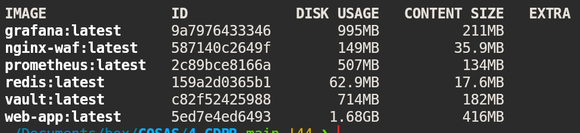

## CONTENEDORES

| Servicio   | Puertos expuesto    | Propósito                          |
|------------|---------------------|------------------------------------|
| nginx-waf  | 8443                | Proxy reverso con WAF y SSL        |
| vault      | 8444                | Almacenamiento seguro de secretos  |
| grafana    | 8445                | Dashboard de monitoreo y métricas  |
| prometheus |                     | Recolección de métricas y logs     |
| redis      |                     | Base de datos en memoria           |
| web-app    |                     | Aplicación principal               |


## Cómo añadir autenticación a otros módulos??

Todo va por token (JWT) o cookie de sesión. Una vez autenticado:
    Cookie (auto-enviada) si el microservicio está en el mismo dominio
    Token (manual) si es API/microservicios a "Otro contenedor"
- Frontend envía token en cabecera Authorization: Bearer <token>
- Backend servicios verifican token con:
	- Microservicios: Envían token a servicio de auth para validar (API call)
	- Monolito/Shared DB: Verifican token directamente (firma JWT)
	- API Gateway: Valida token y propaga headers (ej: X-User-Id)

Login → Auth genera token → Cliente lo guarda (cookie/localStorage)
→ En cada request a otros módulos: envía token → Backend verifica → Acceso autorizado

### La clave son los middleware
- Verifican token/cookie automáticamente en cada request
- Extraen info del usuario (ID, roles, permisos)
- Deciden si la petición pasa o se rechaza
- Propagan contexto (req.user) a todos los módulos

Ejemplo de uso de los middleware de autenticación y checkeo de admin por ruta:
``` javascript
fastify.get('/users', {
	preHandler: [authenticateJWT, requireAdmin]
}, async (request, reply) => {
	return reply.sendFile('users/users.html');
});

```

## Oauth con Github (Montar el "server" de autenticación)

- Antes de nada hay que darle permisos en Authorized OAuth para registrar la App en:
https://github.com/settings/applications . Esto se hace una vez.
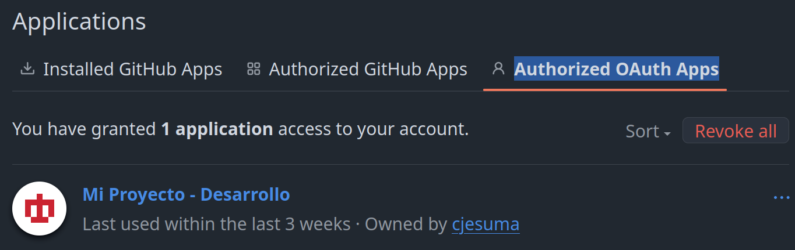

- Configuración
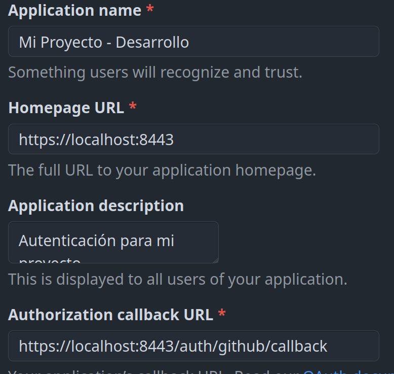

- Los datos que hay que incluir en el .env
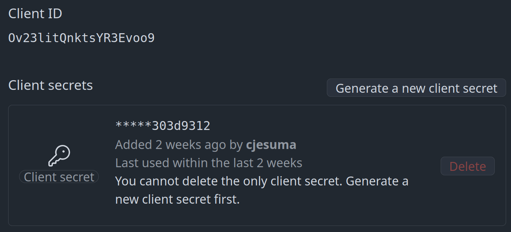

- Confirmo la autorización
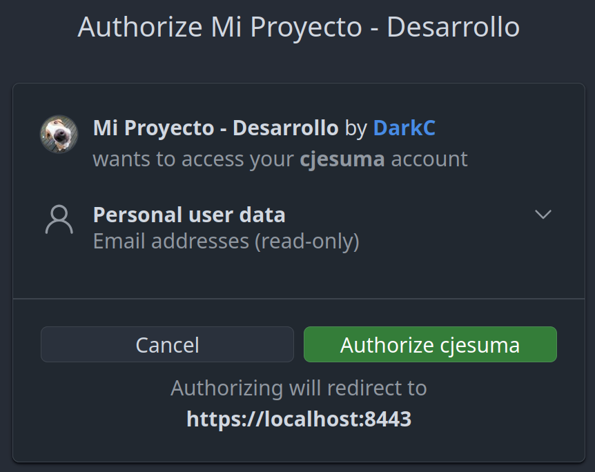

- Hacer uso del boton oauth
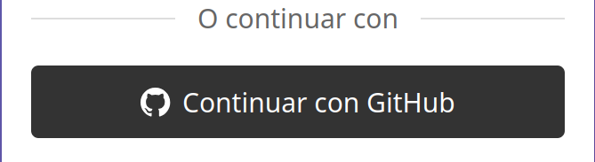

- Usuario autenticado con Oauth. El protocólo solo extrae datos básicos, de los usuarios.
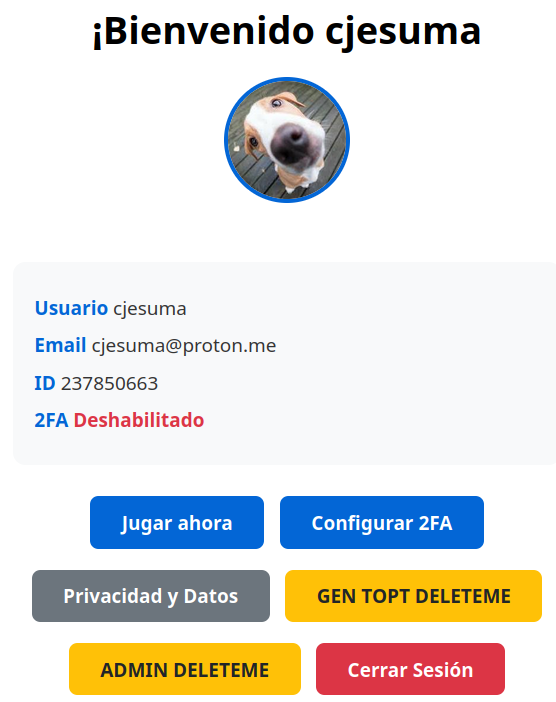

## Login con registro

- Primero resgistrar (Password requiere mayusculas, minusculas, números, especiales)
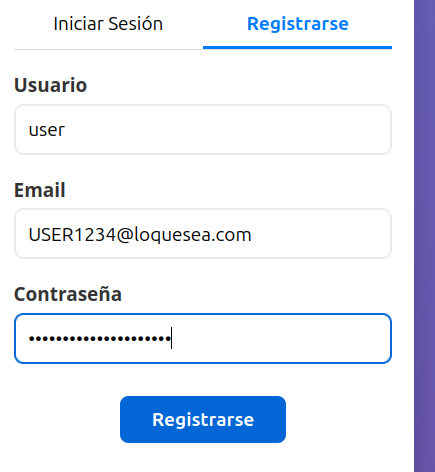

- Perfil con avatar por defecto
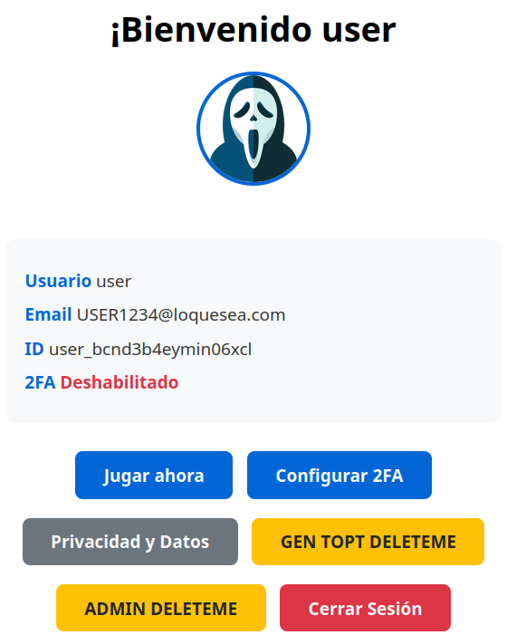

## Activar 2fa

Aún no he consegido que sincronice bien con app de android.
La clave del 2fa es el SECRET. Ejemplo: OBHG2SKNGBGHO4TBHZHW6KDBMMXEWM32GZKGGM3IJJSF4QJVJJNA

Es lo que hay que guardar con cuidado, ya que a partir de ese chorizo se generan los códigos de autenticación. En condiciones normales no se muestra por ningún lado... son las app de autenticación (google aut...etc) las encargadas de guardalas mediante el escaneo del código QR. Pero como no van, pongo algunas alternativas para generar códigos.

1 - Hay un botón en el perfil que dirige a https://localhost:8443/users/decode.html, ahí metes el SECRET que aparece al habilitarlo

2 - https://qrcoderaptor.com/es/

3 - sudo apt install oathtool

`oathtool --totp -b OBHG2SKNGBGHO4TBHZHW6KDBMMXEWM32GZKGGM3IJJSF4QJVJJNA`

- Habilitar 2fa: Dar al botón Gestionar 2FA del perfil
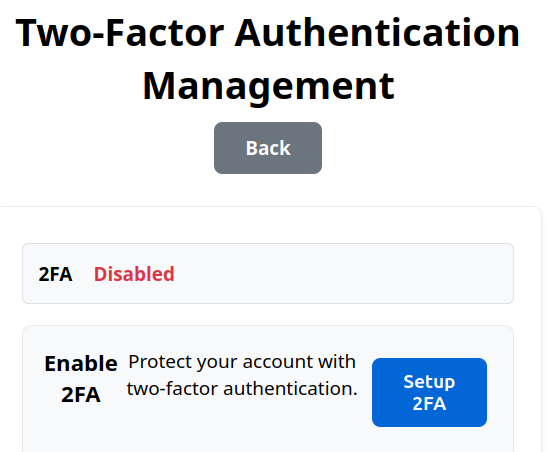

- Copias el secreto de la ventana que sale al pulsar el botón Configurar 2FA. Generas el código y lo pegas (Ver abajo)
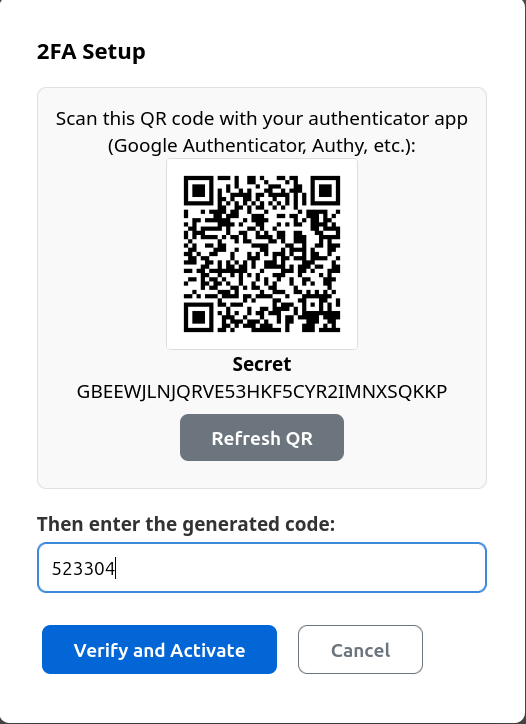

- Te vas a tu generador de códigos favorito (Ojo, estos códigos caducan en segundos)
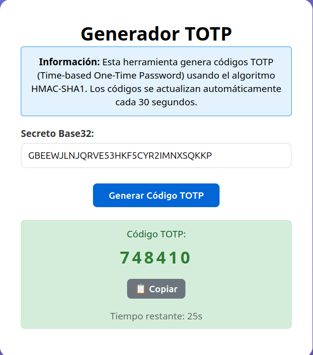

- Una vez habilitado te salen los códigos de recuperación. Que se usan en caso de que al hacer lógin y tener el 2FA activado no tengas tu SECRET porque lo perdiste, borraste la app de autentificación que lo guardaba, etc... Estos códigos se van borrando al usarlos
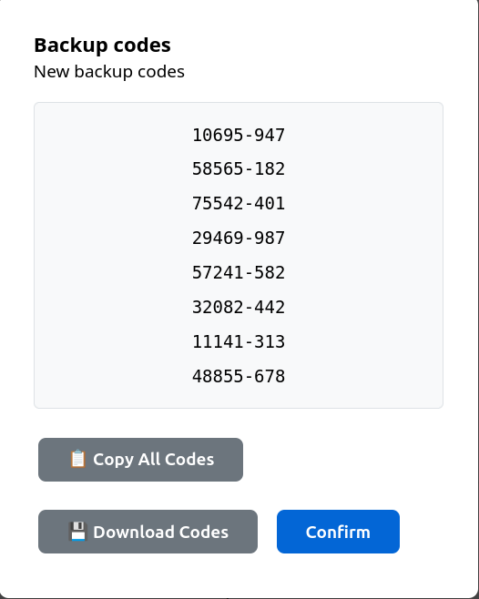

- 2FA ya Habilitado
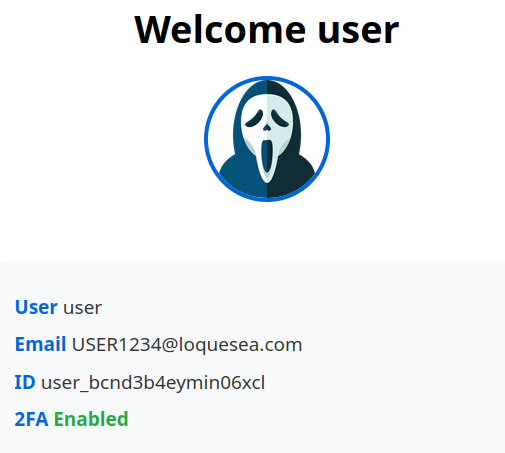

- Ahora despúes de hacer logín con tu email/password también se te pide que generes un código TOTP para acceder
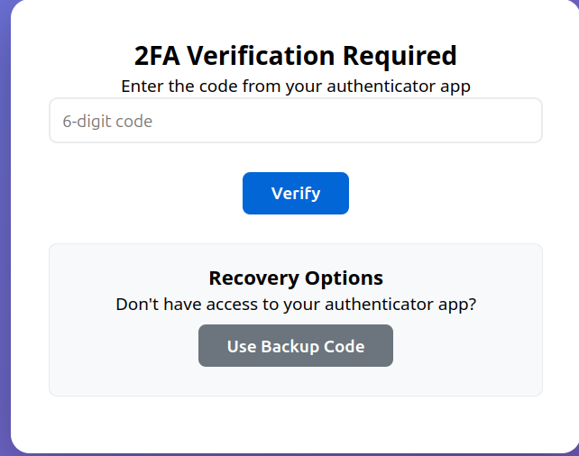

- Para deshabilitarlo, los pasos son los mismos: Le das al botón de deshabilitar, te pedirá un código TOTP, lo metes y se deshabilita.

### Grafana (En construcción)

https://localhost:8445/login User/Password:users/admin -> Skip

https://localhost:8445/dashboards
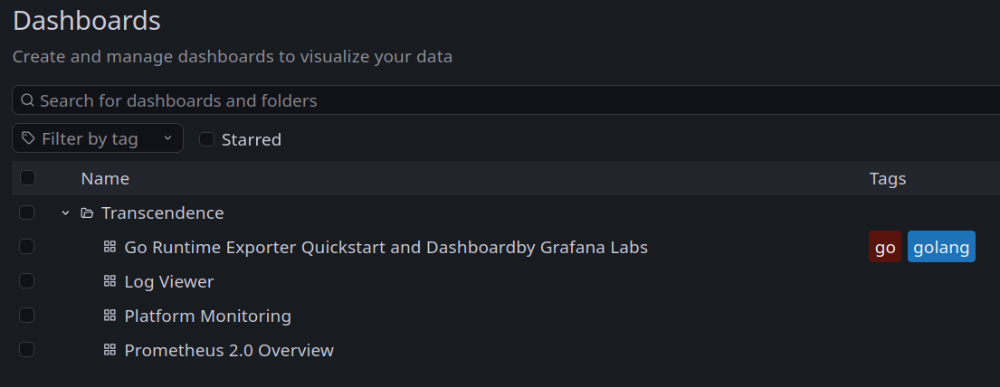
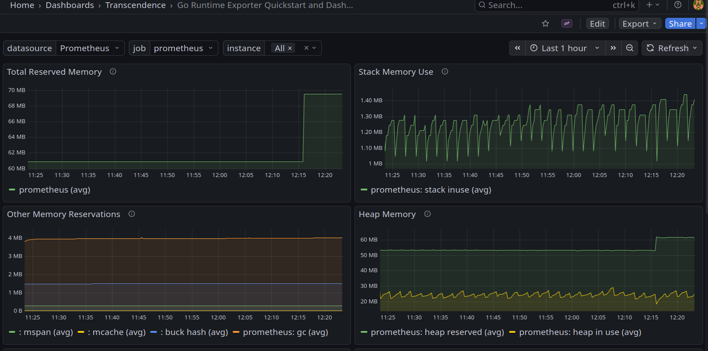

en https://localhost:8445/a/grafana-metricsdrilldown-app/drilldown vienen muchas más métricas por defecto
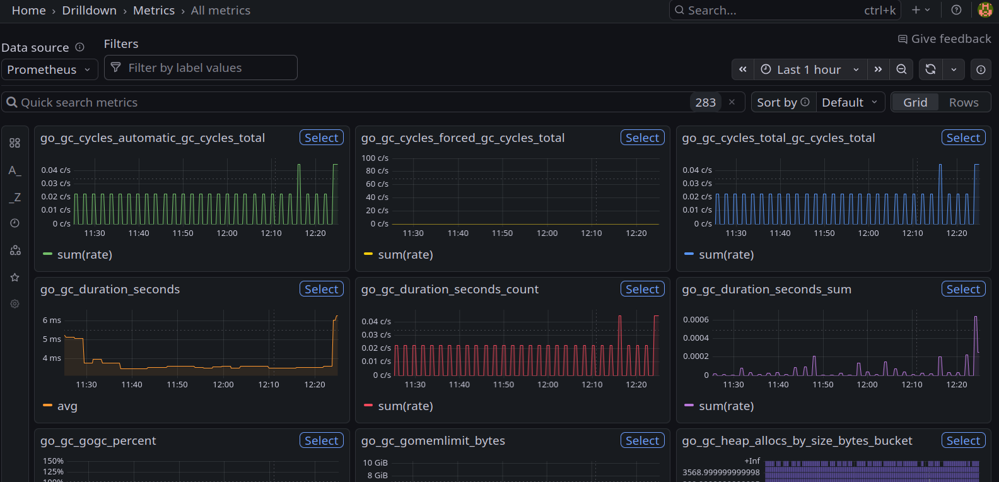

### Archivos de interes

> El servidor node.js se inicia aquí
/backend/index.js

> Creación de tablas y campos de la base de datos
/backend/config/sqlite.js

> Archivo de idiomas
/backend/locales

### URLs de estado de servicios expuestos (todos usan HTTPS)
No se puede incluir como subpath (8443)/grafana porque no lo permiten (O sí?)

> APP
https://localhost:8443/health

> VAULT
https://localhost:8444/v1/sys/health

> GRAFANA
https://localhost:8445/api/health

# TODO
- [ ] Mostrar mejor los fallos en popup y en su idioma correcto
- [X] Terminar GDPR + cookie ?
- [ ] Pasar a TS
- [ ] Crear tests para checkear la seguridad (siege, simuladores de ataque, script, ...)
- [ ] Mejorar grafana
- [ ] 2fa con apps
- [ ] Mejor uso de vault
- [ ] TODO - Parece no sincronizarse con app android
- [ ]
- [ ] + Frances?

## Sugerencias
- [ ] Mirar Oauth con telegram y 42
- [ ] Página error custom
